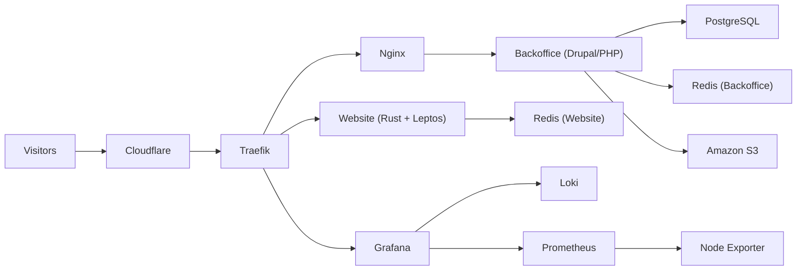

# tiagocode.com

This is my personal blog and portfolio platform.

The goal of this project is simple: publish content, share technical work, and keep operations lean.
Traffic is intentionally low, so the platform is optimized for clarity, reliability, and low cost instead of enterprise-scale complexity.

## Why this monorepo

- Keep website, CMS, health checks, and cloud ops in one place.
- Reduce deployment and pipeline orchestration overhead.
- Make architecture and operations easier to reason about.

## Project principles

- Keep AWS infrastructure simple and cheap to operate.
- Prefer predictable deployments over complex automation.
- Keep observability and basic health checks in place.
- Use the minimum moving parts required for a personal site.

## Architecture

The platform is designed to stay lightweight, observable, and cost-effective for low traffic.
The infrastructure favors a practical setup: Dockerized workloads, Terraform-managed resources, and Cloudflare at the edge.


Diagram sources:
- `./ops/infrastructure/.readme-statics/tiagocode_infrastructure_diagram.drawio`
- `./ops/infrastructure/.readme-statics/tiagocode_infrastructure_diagram.png`



## Why AWS setup is simple

- It is a personal project with modest traffic volume.
- A simpler stack reduces monthly cost and maintenance burden.
- Fewer components means faster debugging and safer changes.

## What is inside

| Area | Path | Purpose |
|---|---|---|
| Website | `apps/website` | Public blog and portfolio UI built with Rust and Leptos. |
| Backoffice | `apps/backoffice` | Drupal CMS used to manage and publish content. |
| Health checks | `ops/healthchecks` | Checks for service availability and basic alerting. |
| Environment setup | `ops/environment-setup` | Runtime stack, app deployment hooks, and compose configuration. |
| Infrastructure | `ops/infrastructure` | Terraform code and architecture assets for AWS/Cloudflare setup. |

## Deployment model (high level)

- Website and backoffice are built as container images and published to GHCR.
- Environment deployment uses CodeDeploy with the environment bundle.
- Infrastructure changes are managed via Terraform workflows.
- Health checks run as operational support, separate from app delivery.

## Repository layout

```text
tiagocode.com/
|-- apps/
|   |-- website/
|   `-- backoffice/
`-- ops/
    |-- healthchecks/
    |-- environment-setup/
    `-- infrastructure/
```
