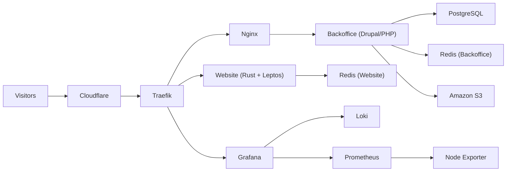

# tiagocode.com

One repository for the full `tiagocode.com` platform.

## Why this monorepo

- Keep website, CMS, health checks, and cloud ops in one place.
- Reduce deployment and pipeline orchestration overhead.
- Make architecture and operations easier to reason about.

## Architecture

The platform is designed to stay lightweight, observable, and cost-effective for low traffic.


Diagram sources:
- `./ops/infrastructure/.readme-statics/tiagocode_infrastructure_diagram.drawio`
- `./ops/infrastructure/.readme-statics/tiagocode_infrastructure_diagram.png`



## What is inside

| Area | Path | Purpose |
|---|---|---|
| Website | `apps/website` | Public site built with Rust and Leptos. |
| Backoffice | `apps/backoffice` | Drupal CMS for content management. |
| Health checks | `ops/healthchecks` | Monitoring scripts and alerting hooks. |
| Environment setup | `ops/environment-setup` | Docker Compose stack and deployment scripts. |
| Infrastructure | `ops/infrastructure` | Terraform modules and infrastructure docs. |

## Repository layout

```text
tiagocode.com/
|-- apps/
|   |-- website/
|   `-- backoffice/
`-- ops/
    |-- healthchecks/
    |-- environment-setup/
    `-- infrastructure/
```
